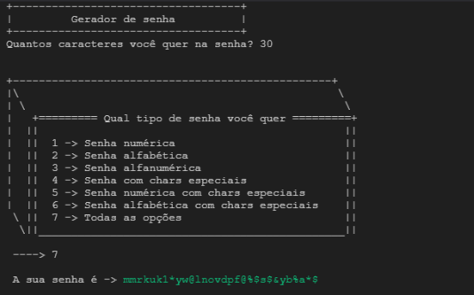

# Gerador de senha em Phyton

 

* Primeiro escolha o tamanho da sua senha;
* Por fim escolha o tipo de senha.

 

~~~
          +-----------------------------------+
          |         Gerador de senha          |
          +-----------------------------------+
          Quantos caracteres você quer na senha? 30
~~~

~~~
      +-------------------------------------------------+ 
      |\                                                 \
      | \                                                 \
      |   +========= Qual tipo de senha você quer =========+
      |  ||                                               ||
      |  ||  1 -> Senha numérica                          ||
      |  ||  2 -> Senha alfabética                        ||
      |  ||  3 -> Senha alfanumérica                      ||
      |  ||  4 -> Senha com chars especiais               ||
      |  ||  5 -> Senha numérica com chars especiais      ||
      |  ||  6 -> Senha alfabética com chars especiais    ||
      \ ||  7 -> Todas as opções                         ||
        \||_______________________________________________||

      ----> 7
~~~

~~~
          A sua senha é -> mmrkuk1*yw@lnovdpf@%$s$&yb%a*$
~~~
